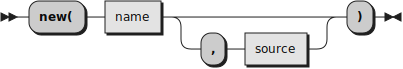

# The Tree API

There are two main ways to use [the Rexx Parser](TheRexxParser.md): using [the Tree API](TreeAPI.md), described here, and using [the Token API](TokenAPI.md).

## First steps

To use [the Tree API](TreeAPI.md), we will need to create an instance of [the Rexx Parser](TheRexxParser.md).



The optional `source` argument is an array of lines; if you do not specify it, the name is used to identify a file containing the program source.

```rexx
parser  = .Rexx.Parser~new(file, source)
```

We can now retrieve a representation of the parser program by using the `package` method. 


```
package = parser~package
```

The `package` method of the `Rexx.Parser` class returns a `Rexx.Package` object, containing a high-level syntactical representation of our just parsed program.

## Accessing the prolog


