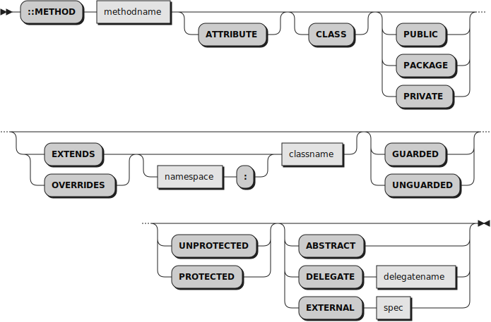

The class extension mechanism
=============================

------------------------------

Introduction and specification
------------------------------

A number of mechanisms have been proposed
to extend both user-defined and built-in Rexx classes.
JLF has created [a very detailed synopsys of these
mechanisms.](https://github.com/jlfaucher/executor/blob/master/sandbox/jlf/_changes.md#2extensions)

The Rexx Parser implements a class extension mechanism suggested by
Gil Barmwater, with some additions suggested by Josep Maria Blasco.
**Extending** a class consists in **adding** or **replacing** some methods
to that class.

To **add** a new method to a class, use
the `EXTENDS` subkeyword:

~~~rexx {experimental}
::Method methodname Extends namespace:classname
~~~

The _namespace_ qualifier is optional.
If a method called _methodname_ already exists in class
_classname_, a `SYNTAX` condition is raised.

To **replace** an existing method, or to add a new method when
no method called _methodname_ exists, use the
`OVERRIDES` subkeyword:

~~~rexx {experimental}
::Method methodname Overrides namespace:classname
~~~

The _namespace_ qualifier is optional.
You can specify one or none of `EXTENDS` or `OVERRIDES`,
but not both in the same directive.

Extension methods can be placed anywhere after the prolog
in the source program, that is, they do not need to
be placed before the first class definition, if any.

Here is the complete and updated syntax diagram for the `::METHOD`
directive.

 \

Implementation
--------------

`EXTENDS` and `OVERRIDES` options are recognized by the Parser
only when the Experimental option has been turned on:

```rexx
  /* allOptions contains the allowed options for the ::METHOD directive */
  If .Options.Experimental Then Do
    allOptions[] = "EXTENDS"
    allOptions[] = "OVERRIDES"
  End
```

The Rexx Parser stores the specified option, the _namespace_ and
the _classname_ in the parse tree.

To make use of the enhanced parse tree, we need to transform
our program into standard ooRexx. To this effect, we will
be using [a small compile module, `classextensions.cls`](../../../bin/modules/experimental/classextensions.cls?view=highlight).
Compile modules build over
[the predefined identity compiler module, `compile.cls`](../../../bin/modules/identity/compile.cls?view=highlight).
The identity compiler module compiles a program into a perfect
copy of itself. Specialized compiler modules add
new `compile` methods to one of more of the Rexx Parser classes
to provide particular compilation features in a very simple way.
In our case, we only have to add a `compile` method
to [the `Method.Directive` class](../../ref/classes/rexx.clause/rexx.directive/method.directive/).

The task of our new `compile` method is to translate
the new, experimental, Rexx features into standard ooRexx.
We do that as follows:

* When no `EXTENDS` or `OTHERWISE` phrase is present,
  the directive is copied without modification to the
  translated program.

* Otherwise, the _methodname_ is combined with the _namespace_
  (if present) and the _classname_ to form a new name as follows:

  ```
    newname ::= methodname'<'separator'>'[namespace':']classname,
  ```

  where the _separator_ is `"+"` for `EXTENDS` and `"*"`
  for `OVERRIDES`. The new name is then enclosed between quotes
  and substitutes _methodname_ in the translated program.

* The whole `EXTENDS` or `OVERRIDES` phrases are commented
  out.

The whole compilation process is governed by
[`erexx.rex`, the Experimental compiler](../../../bin/erexx.rex?view=highlight).
`erexx` compiles the
source program and then adds
[a call to `EnableExperimentalFeatures`](../../../bin/EnableExperimentalFeatures.rex?view=highlight)
at the beginning of the
program (we have to pass `.METHODS` as a parameter
because of ooRexx bug no. [2037](https://sourceforge.net/p/oorexx/bugs/2037/)).

```rexx
  -- Add a call to the enabler for experimental features
  If output[1][1] == "#" Then insertAt = 2 -- A shebang
  Else                        insertAt = 1
  output[insertAt] = "Call EnableExperimentalFeatures .Methods; "output[insertAt]
```

`EnableExperimentalFeatures` first inspects the `.METHODS` stringtable
of the caller, to see if any of the methods names contain
the substring `"<+>"` or `"<*>"`. When such a method is found,
the program

* breaks the new method name into its components, to get
  back _methodname_, _namespace_ and _classname_;
* resolves the _namespace_, if present, and the _classname_,
  to get a Class object;
* checks that an existing method called _methodname_
  does not exist in the Class object (for `EXTENDS` only);
* uses the `define` method of the Class object to add
  a new method called _methodname_ to the class; and
* deletes the entry indexed by the new name in the
  `.METHODS` stringtable.

When processing of `.METHODS` has ended, a similar
process is started with all of the classes defined in the
caller package (`classes` method of the package class).
In that case, methods are first added or replaced in the corresponding
class, and later deleted in the class that defined them.

Example
-------

The following is `extends.rex`, located in the `tests/experimental` directory:

```rexx {experimental source="../../../tests/experimental/extends.rex"}
```

And here is `extended.cls`, located in the same directory.

```rexx {experimental source="../../../tests/experimental/extended.cls"}
```

When `erexx extends` is executed, this is the translated program that
gets called:

```rexx {experimental source="../../../tests/experimental/extends.rex.translated"}
```

And this is the output from running the program:

```
.Methods[Floating]=a Method
Method A has disappeared from the .METHODS stringtable
.Methods[A]       =The NIL object
The translated method name has also disappeared
.Methods['M<+>X:CLASS1']=The NIL object
Class AClass does not have methods called M or O
M: 0
O: 0
Creating a CLASS1 object...
Invoking CLASS1 method A...
Class1 method A called
Invoking CLASS1 method M...
Class1 method M called
Invoking CLASS1 method O...
Replaced method called
```

Limitations
-----------

* Because of the way we use to encode _methodname_, _namespace_
  and _classname_ in a single string, we cannot handle
  methods that contain `"<+>"` or `"<*>"` as part of
  their name, or class names which contain a colon `":"`.
* The `classes` method of the `Rexx:Package` class
  returns a stringtable indexed by the class names,
  which does not store the order in which these
  classes have been defined in the source package.
  This means that `EnableExperimentalFeatures`
  will process extension methods defined "inside"
  classes in the (undefined) order provided by
  the stringtable supplier.

