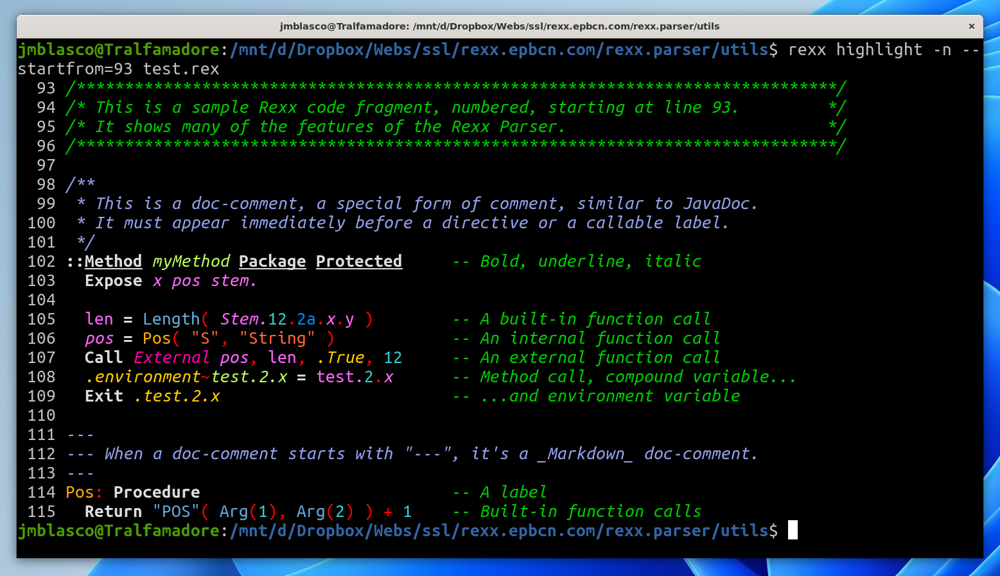

The ANSI Highlighter
==========================

------------------------------

ANSI SGR Codes
--------------

The ANSI Highlighter (that is, [the Rexx
Highlighter](../) operating in ANSI mode) uses ANSI SGR
[(Select Graphic Rendition)](https://en.wikipedia.org/wiki/ANSI_escape_code#Select_Graphic_Rendition_parameters)
codes to highlight a Rexx program. Only a subset of all the ANSI SGR codes
are used, namely (`ESC` denotes character `"1B"X`):

\

Code                                                                Meaning
------------------------------------------------------------------- ------
`ESC[0m`                                                            All attributes off
`ESC[1m`                                                            Bold
`ESC[3m`                                                            Italic
`ESC[4m`                                                            Underline
<code>ESC[38;2;<em>r</em>;<em>g</em>;<em>b</em>m</code>&nbsp;&nbsp; Set foreground color to RGB(*r*,*g*,*b*)
<code>ESC[48;2;<em>r</em>;<em>g</em>;<em>b</em>m</code>&nbsp;&nbsp; Set background color to RGB(*r*,*g*,*b*)

\

Different SGR codes can be combined
in a single sequence by separating them
using semicolons. For example, `ESC[1;3;38;2;255;0;0m`
means "choose a bold font, choose an italic font,
and set the foreground color to pure red".

Implementation differences
--------------------------

Terminal applications and emulators differ
wildly in their support of ANSI SGR codes.
The default configuration of the Windows terminal,
for example, implements boldface by substituting
colors with a lighter version of themselves, and that,
only for basic colors (i.e., codes 30-37, 40-47, 90-97 and 100-107);
the same is true of the default terminal
for Ubuntu WSL.

Additionally, support for basic colors is abundantly erratic:
see, as an example, [the color chart that appears
in the Wikipedia](https://en.wikipedia.org/wiki/ANSI_escape_code#3-bit_and_4-bit).
In an attempt to minimize this problem, all the colors generated by the ANSI highlighter
are emitted using the 38 and 48 codes, i.e., they are pure RGB colors.
[CSS named colors](https://www.w3.org/TR/css-color-4/#named-colors) are also translated
to their RGB definitions: you can be sure that foreground `blue` will be generated as `#0000ff`,
that is, as `ESC[38;2;0;0;255m`. How this displays in your emulator may vary.

 

<figure>

<figcaption class="text-center">
<small>Screen capture of a run of the highlighter under Sakura/Ubuntu 22/WSL.</small>
</figcaption>
</figure>

 

Please note that some less known
terminal emulators, like [Sakura](https://github.com/dabisu/sakura),
seem to work much better, out of the box, than
the standard Windows tools.

Selecting ANSI mode
-------------------

If you are working from the command line, the
[*highlight*](/rexx-parser/doc/utilities/highlight/) utility will
automatically select ANSI mode when attempting to highlight
a `.rex` program. You can also manually select ANSI mode
by using the `-a` or `--ansi` options.
