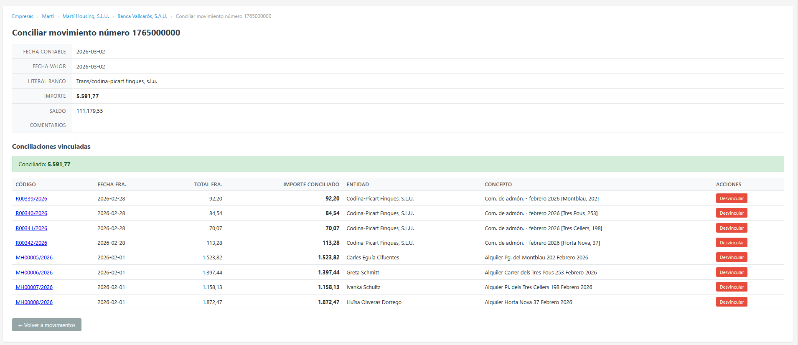

::::: title-page

Artifacts of the Ephemeral
==========================

::: author
[Josep Maria Blasco](https://www.epbcn.com/equipo/josep-maria-blasco/)
:::

::: affiliation
Espacio Psicoanalítico de Barcelona
:::

::: event
37th International Rexx Language Symposium
:::

::: venue
Barcelona, May 3--6, 2026
:::

:::::

About This Presentation {.slide}
=========================

All examples and demos in this presentation have been
tested with Claude Opus 4.7 from Anthropic.  The approaches described here
should be transferable to models of comparable capability,
with appropriate adaptations.

\


<small><b>Note:</b> This document[^ThisDoc] was written using
[RexxPub](https://rexx.epbcn.com/rexx-parser/doc/rexxpub/),
a Rexx Publishing Framework.[^RexxPub]</small>

[^ThisDoc]: URL of this document:
<https://www.epbcn.com/pdf/josep-maria-blasco/2026-05-04-Artifacts-of-the-Ephemeral.pdf>;
HTML version:
<https://rexx.epbcn.com/rexx-parser/doc/publications/37/2026-05-04-Artifacts-of-the-Ephemeral/>.
Presented to the
[37th International Rexx Language Symposium](https://www.rexxla.org/events/schedule.rsp?year=2026),
held at the
[Espacio Psicoanalítico de Barcelona](https://www.epbcn.com/) and online from the 3rd to the 6th of May, 2026.

[^RexxPub]: See <https://rexx.epbcn.com/rexx-parser/doc/rexxpub/>.

Advanced AI Assistants Have a Computer Inside {.part}
=============================================

There's a Computer in There {.slide}
============================

Open a chat with a modern AI assistant, and a full Linux
machine boots behind the scenes.  Not a simulation.  Not a
sandbox.  A real Ubuntu 24.04 with root access, network, and
a complete toolchain.

~~~bash
lsb_release -a
~~~
~~~
Distributor ID: Ubuntu
Description:    Ubuntu 24.04.1 LTS
Release:        24.04
Codename:       noble
~~~

The chat interface is only the surface.  Behind it, there's
an entire computer sitting there, waiting.

A Complete Environment {.slide}
=======================

The AI environment is a standard Linux box --- install
packages, compile C, run servers.  Anything you'd do on a
fresh Ubuntu machine, your assistant can do:

~~~bash
curl -o /tmp/oorexx.deb https://rexx.epbcn.com/oorexx-barcelona2026.deb
dpkg -i /tmp/oorexx.deb
rexx -e "say 'Hello from the 37th International Rexx Symposium!'"
~~~
~~~
Hello from the 37th International Rexx Symposium!
~~~

That's ooRexx, running inside the assistant's session.  Downloaded,
installed, executed, and ready for real work --- in seconds.

But It's Ephemeral {.slide}
===================

When you close the chat, the machine disappears.  Everything
--- installed software, files, state --- gone.

Next session, your assistant starts from zero.  No memory
of what you did, what you built, or what you agreed on.  A
fresh machine, a blank slate.

~~~
> Can we continue our conversation about the Papoola?
I don't have any memory of previous conversations — each chat with me
starts fresh.  So I don't have context on what we discussed about
the Papoola before.
~~~

This is both a limitation and a design constraint.  It shapes
everything that follows.  We will come back to it.

Three Projects {.part}
===============

A Note on Skills {.slide}
==================

For the assistant to write idiomatic ooRexx, we give it a _skill_:
not a reference manual --- it already knows the language ---
but a two-page list of pitfalls.  Don't use `RESULT` as a
variable name.  The logical operators are not short-circuit.
That kind of thing.

~~~rexx
-- WRONG: crashes if i == 1
If ch == "#" & i > 1 & text[i - 1] == " " Then ...

-- RIGHT: commas as short-circuit AND
If ch == "#", i > 1, text[i - 1] == " " Then ...
~~~

With that, it programs in ooRexx more than decently.  Now,
three projects.

From a Spreadsheet to a Web Application (1/4) {.slide}
=============================================

The starting point was a real spreadsheet managing the finances
of a group of companies: an entity registry (suppliers, clients,
banks, tax authorities), issued and received invoices, bank
statements with simplified accounting categories and cost centres,
and summary sheets providing treasury and accounting views ---
all dynamically customizable by date, including forecasts.

We uploaded the spreadsheet to the AI and started asking
questions.  It handled the Excel data effortlessly.
Then came the real question: could it replicate this
functionality as a set of ooRexx CGIs?

From a Spreadsheet to a Web Application (2/4) {.slide}
=============================================

<figure>

<figcaption>Treasury view</figcaption>
</figure>

From a Spreadsheet to a Web Application (3/4) {.slide}
=============================================

In about a week of intensive work, the assistant built a
complete web application.  It wrote the CGIs, the CSS, and
the JavaScript from scratch, running on RexxHttp --- an
ooRexx CGI framework written in 2006 that still powers most
of our sites.  We discussed and agreed design decisions together.

A second week went into polishing the migration to SQLite ---
the assistant tended to get confused by the denser,
multi-column sections of the spreadsheet,
and untangling them took real effort.
The application is in production today.

From a Spreadsheet to a Web Application (4/4) {.slide}
=============================================

<figure>

<figcaption>Bank reconciliation detail</figcaption>
</figure>

Picking Up ooSQLite (1/5) {.slide}
=========================

ooSQLite is an ooRexx binding for SQLite, originally written
by Mark Miesfeld.  After Mark's untimely death in 2012, the
project was largely abandoned.  From time to time someone
would touch it, but there was no sustained development.

We asked the AI to look at the project.  It compiled
ooSQLite from source, studied the manual, and wrote a test
harness from scratch.  When the tests ran, they uncovered
several bugs in the original code.

**Josep Maria:**
*Now write a test for aggregate UDFs on an empty result set. We need to
verify that `xFinal` handles the case where `xStep` was never called.*

Picking Up ooSQLite (2/5) {.slide}
=========================

**Claude:**
*Here's the test:*

```rexx
::Method testAggregateSumEmptyResultSet
  db = self~openMemoryDB
  db~exec("CREATE TABLE nums (val INTEGER);")
  handler = .AggregateSumHandler~new
  rc = db~createFunction("rexx_sum", handler, 1, , "xStep", "xFinal")
  self~assertEquals(0, rc, "createFunction should return OK")
  rows = db~exec("SELECT rexx_sum(val) FROM nums;", .true)
  self~assertEquals(0, rows[1]["REXX_SUM(VAL)"], -
    "SUM on empty table should return 0")
  db~close
```
```
> Segmentation fault (core dumped)
```

Picking Up ooSQLite (3/5) {.slide}
=========================

**Claude:**
*That's a SIGSEGV. Let me look at `finalCallback()` in `ooSQLite.cpp`.
The problem is at line 2302:*

```cpp
pCFunctionCallback pcf = pcacb->pcfcb;
```

*`pcfcb` is only initialized inside `stepCallback()`:*

```cpp
if ( pcacb->pcfcb == NULL )
{
    pcacb->aggregateObj = TheNilObj;
    pcacb->pcfcb = (pCFunctionCallback)sqlite3_user_data(sqlContext);
}
```

Picking Up ooSQLite (4/5) {.slide}
=========================

*When the result set is empty, `stepCallback` is never invoked, so
`pcfcb` remains NULL. Then `finalCallback` dereferences it — crash.*

*The fix is straightforward: add the same NULL-check at the top of
`finalCallback()`:*

```cpp
if ( pcacb->pcfcb == NULL )
{
    pcacb->aggregateObj = TheNilObj;
    pcacb->pcfcb = (pCFunctionCallback)sqlite3_user_data(sqlContext);
}
```

**Josep Maria:**
*Nice catch. Skip the empty-set case in the tests for now — we'll
revisit when we fix the C++.*

Picking Up ooSQLite (5/5) {.slide}
=========================

The author of these slides can read C++ but would not be able
to maintain a project like ooSQLite alone.  AI makes it
possible for a developer to pick up an abandoned project
in a language that is not their strongest, understand it,
test it, and start improving it --- work that would otherwise
remain undone.

The Rexx Parser[^companion] (1/3) {.slide}
=================================

The Rexx Parser is a comprehensive parser for ooRexx, currently
in active development.  In a fresh session, the assistant sets
up the whole environment from scratch: it downloads the project,
installs ooRexx, runs the unit test suite, installs Apache
with CGI support, deploys the parser's web interface,
and runs the integration tests against it.

This is more than writing code.  It's operating a real software
project --- dependencies, infrastructure, deployment, testing ---
end to end, in a single session, on a machine that didn't exist
an hour ago.

[^companion]: The Rexx Parser and RexxPub (a publishing framework
built on top of the Parser) each have a dedicated companion
presentation at this Symposium: _The Rexx Parser Revisited_ and
_RexxPub --- A Rexx Publishing Framework_.

The Rexx Parser (2/3) {.slide}
=====================

```rexx {style=dark unicode}
/* Sample Rexx code with TUTOR extensions                                     */
::Method open Package Protected
  Expose x pos stem.
  Use Strict Arg name

  a   = 12.34e-56 + " -98.76e+123 "     -- Highlighting of numbers
  len = Length( Stem.12.2a.x.y )        -- A built-in function call
  pos = Pos( "S", "String" )            -- An internal function call
  Call External pos, len, .True         -- An external function call
  .environment~test.2.x = test.2.x      -- Method call, compound variable
  Exit "नमस्ते"G,  "P ≝ 𝔐",  "🦞🍐"     -- Unicode strings

Pos: Procedure                          -- A label
  Return "POS"( Arg(1), Arg(2) ) + 1    -- Built-in function calls
```

The Rexx Parser (3/3) {.slide}
=====================

From there, everyday work proceeds normally: add a new option
to one of the parser's utilities, write the corresponding unit
test, update the documentation, run the full test suite.  Code,
tests, and documentation --- maintained as a single, coherent
flow.

A Metaproject {.part}
=============

The Continuity Problem {.slide}
=======================

We saw earlier that the machine disappears at the end of every
chat.  For an ongoing project, that's a serious problem: every
session, your assistant starts with no knowledge of what was
done before, what conventions were agreed upon, or what's left
to do.

Developers who use AI assistants for real work already handle
this --- pasting a summary at the start of each chat, uploading
notes from the previous session, keeping a handoff document.
These are all sensible responses to the same problem.  They
just tend to be informal, inconsistent, and hard to maintain
as the project grows.

We were no exception.  So we formalised what we were already doing.

Separating State from Project (1/3) {.slide}
===============================

The key idea is to separate _state_ from _project_.

| Project | What's in it |
|---|---|
| A Rexx parser | Code, tests, build infrastructure |
| A financial management web application | Accounting records, company setup, database schema |
| A book | Manuscripts, references |
| A Symposium paper | Slides, iterations, references |

The _project_ is the thing you're working on.
It can be something you've been working on for years,
or something you're starting from scratch — the metaproject doesn't care.

Separating State from Project (2/3) {.slide}
===============================

| File | Purpose |
|---|---|
| `setup.md` | How to start the environment |
| `handoff.md` | What happened last session |
| `conventions.md` | Style, terminology, decisions that stick |
| `handoffs/` | Archive of previous handoffs |
| ... | ... |

The _state_ is everything the assistant needs to pick up
where the last session left off: what was done, what was decided,
how the project is organised, and what to do next. The metaproject
manages the state as a simple set of markdown files.

Separating State from Project (3/3) {.slide}
===============================

From `handoffs/handoff-20260419-v3.md`:

> On review, I flagged the Papoola reference as obscure for
> the RexxLA audience.  Josep Maria pushed back: *"I always like to
> introduce an absurd, surreal touch in my texts --- the
> Papoola is from Philip K. Dick's The Simulacra, and one
> of my Linux boxes is called Tralfamadore, an
> extraterrestrial planet invented by Vonnegut."*  Withdrawn.
> Nerd-pass granted, no questions asked: *"this is not a
> business meeting, it's a Symposium of programmers."*

An Artifact of the Ephemeral {.slide}
============================

Once you make that separation, something follows: the state is
no longer informal documentation.  It becomes an artifact of
the ephemeral.  And if it's an artifact, it deserves to be
treated as one --- with its own structure, its own protocols,
its own versioning.

That's what a _metaproject_ is: a project whose object is
other projects.

For a developer who wouldn't otherwise organise state
transfer by hand, the metaproject automates it entirely.  For a
developer who would --- and could --- organise it themselves,
the metaproject offloads that work to the assistant, which
applies the protocol consistently and never forgets a step.

::::: closing-page

Thank You! {.slide}
===========

Questions?

<mailto:jose.maria.blasco@gmail.com>

Downloads:
\
<https://rexx.epbcn.com/metaproject/metaproject-latest.zip>.

:::::