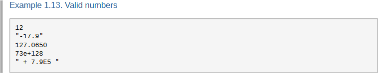

::::: title-page

The Rexx Parser Revisited <small>An Updated Overview</small>
=====================================================================

::: author
[Josep Maria Blasco](https://www.epbcn.com/equipo/josep-maria-blasco/)
:::

::: affiliation
Espacio Psicoanalítico de Barcelona <br> Balmes, 32, 2º 1ª &mdash; 08007 Barcelona
:::

::: email
jose.maria.blasco@gmail.com
:::

::: phone
+34 93 454 89 78
:::

::: date
May the 6<sup>th</sup>, 2026
:::

:::::

::: text-center
*<small>This document[^thisDoc] was written using [RexxPub, a Rexx Publishing Framework](https://rexx.epbcn.com/rexx-parser/doc/rexxpub/).[^rexxpub]</small>*
:::

[^thisDoc]: <small>URL</small> of this document: <https://www.epbcn.com/pdf/josep-maria-blasco/2026-05-06-The-Rexx-Parser-Revisited.pdf>;
<small>HTML</small> version: <https://rexx.epbcn.com/rexx-parser/doc/publications/37/2026-05-06-The-Rexx-Parser-Revisited/>.
Presented to the [37th International Rexx Language Symposium](https://www.rexxla.org/document.rsp?base=events&year=2026&doc=announcement.html&title=Announcement),
held at the [Espacio Psicoanalítico de Barcelona](https://www.epbcn.com/) and online from the 3rd to the 6th of May, 2026.

[^rexxpub]: See <https://rexx.epbcn.com/rexx-parser/doc/rexxpub/>. RexxPub is the subject
of a companion article [@RexxPub2026] presented at this same Symposium.

Introduction
============

The Rexx Parser was first presented at the 36th International Rexx Language
Symposium, held at the Wirtschaftsuniversität Vienna in May 2025, in two
companion talks: one covering the Parser itself — its architecture, the
Element and Tree APIs, the module system, and the early check framework
[@RexxParser2025] —
and a second one devoted to the Rexx Highlighter, the Parser's syntax
highlighting subsystem [@RexxHighlighter2025].

In the year that followed, the project has grown substantially. The Parser
gained full support for Jean Louis Faucher's Executor,[^Executor] an experimental
extension of ooRexx that introduces source literals, named arguments, and
a rich set of syntactic additions. An identity compiler, built as a Parser
module, made it possible to implement source-to-source transformations —
and `erexx`, the experimental Rexx compiler, demonstrated the concept with
a class extension mechanism that allows new methods to be defined for a class declared
in a different source package. The early check system was extended to cover `LEAVE` and
`ITERATE` errors.

The Highlighter, meanwhile, added a fourth output driver targeting DocBook
XML — the format used by the official ooRexx documentation — bringing
parse-aware syntax highlighting to that documentation for the first time. Other Highlighter improvements include detailed
highlighting of strings and numbers (where individual components such as
quotes, suffixes, exponents, and decimal points can be styled
independently), doc-comments in both classical and Markdown variants,
and an extensive collection of Vim-derived colour schemes contributed by
Rony Flatscher.

On top of all this, a new subproject emerged: RexxPub, a Rexx-based
publishing framework that combines the Parser, the Highlighter, and Pandoc
into a pipeline capable of producing web pages, print-ready articles,
letters, slide decks, ebooks, and PDF files from a single Markdown source —
including, naturally, beautifully highlighted Rexx code. This article itself
was written in RexxPub. A companion article presented at this same
Symposium [@RexxPub2026] describes RexxPub in detail.

The first part of this article describes the Parser as it stands today:
its two APIs, command-line utilities, early checks, module system, and
self-consistency infrastructure. The second part covers the Highlighter.
The third part presents what is new since the Vienna Symposium — except
for RexxPub, which is covered in its own paper — from Executor support
through the identity compiler, the DocBook driver, and the latest
Highlighter features. The article closes with a survey of directions for
future work.

[^Executor]: <https://jlfaucher.github.io/executor/>.

The Rexx Parser
===============

**[The Rexx Parser](https://rexx.epbcn.com/rexx-parser/)** is a full Abstract Syntax Tree (AST)
parser for the [Open Object Rexx (ooRexx)](https://en.wikipedia.org/wiki/Object_REXX),
[Classic Rexx](https://en.wikipedia.org/wiki/Rexx) (which includes
[Regina Rexx](https://regina-rexx.sourceforge.io/) and mainframe Rexx) and
[Executor](https://jlfaucher.github.io/executor/) variants of the Rexx language.
It has been written
and is being maintained by [Josep Maria Blasco](https://rexx.epbcn.com/josep-maria-blasco/),
and includes contributions from other authors.

The Parser also includes optional support for
[TUTOR](https://rexx.epbcn.com/TUTOR/)-flavoured Unicode Rexx programs [@TUTOR2024; @TUTOR2025],
and is hosted at <https://rexx.epbcn.com/rexx-parser/>, where daily builds and
full documentation are available, and at <https://github.com/JosepMariaBlasco/rexx-parser/>,
which carries releases with version control and issue tracking.
It is also distributed as part of
net-oo-rexx[^netoorexx], a software bundle curated by Rony Flatscher.

[^netoorexx]: <https://wi.wu.ac.at/rgf/rexx/tmp/net-oo-rexx-packages/>.

The Element API {#elementAPI}
---------------

When parsing a Rexx program, the Parser first breaks it into a doubly-linked list
of *elements*. An element is either a standard Rexx token,
or one of several additional constructs that the Parser inserts or recognizes: whitespace that does not
function as an implicit concatenation operator, comments, and a set of synthetic elements
implied by the Rexx language rules or inserted to facilitate higher-level analysis.

### The power of the Element API

Despite its apparent simplicity, the Element API is powerful enough to build quite
sophisticated applications. The most prominent example is [the Rexx Highlighter](#highlighter), described
below. Another example is `rxcomp`, a utility that checks whether two Rexx programs
are semantically equivalent — that is, whether they differ only in whitespace and
comments — by comparing their element sequences. The `elements` utility, described
in [Command-Line Utilities], displays the complete element chain of a parsed program.

### Element categories and attributes

Every element carries a *category* (for example, `.EL.KEYWORD`, `.EL.STRING`,
`.EL.SIMPLE_VARIABLE`, or `.EL.STANDARD_COMMENT`)[^categories] and a set of attributes, including
its position in the source, whether it was inserted by the Parser, whether it is
ignorable (whitespace and comments are), and whether it is an assignment target.
Compound variable elements additionally carry a list of *parts*, one for each component
of the variable's stem and tail.

[^categories]: <https://rexx.epbcn.com/rexx-parser/doc/ref/categories/>.

### The `<` operator

The Parser overloads the `<` operator of the Element class so that
the category of an element can be checked using `<` or `\<`, which
can be read as "is a" or "is not a". The right hand side of such a comparison can
also be a *set* of categories, in which case the operators
can be read as "is one of" or "is not one of".
This makes category tests both shorter and less error‑prone
than inspecting raw numeric codes or strings.

```rexx {caption="Querying an element's category"}
If element < .EL.SIMPLE_VARIABLE Then Do
  -- element's category is .EL.SIMPLE_VARIABLE
End
```

Element categories and category sets are defined in the `bin/Globals.cls`
package.

### An example program {#elementAPIExample}

The following program exemplifies the use of the Element API to list all the ooRexx
`::CLASS` names defined in a source file and the
line in which they have been defined. Since this is an illustrative sample,
no attempt has been made to implement error handling.

```rexx {caption="Listing ::CLASS directives using the Element API"}
  Parse Arg filename

  parser = .Rexx.Parser~new( filename ) -- Create a parser object
  element = parser~firstElement         -- Get the first element in the chain
  inAClassDirective = .False
  headerPrinted     = .False

  Loop Until element == .Nil            -- Traverse the whole chain

    If element < .EL.DIRECTIVE_KEYWORD Then Do
      If element~value == "CLASS" Then  -- element~value is always uppercase
        inAClassDirective = .True
    End

    element = element~next              -- Jump to the next element

    -- We are only interested in the first taken_constant after ::CLASS
    If \inAClassDirective            Then Iterate
    If element \< .EL.TAKEN_CONSTANT Then Iterate

    -- Print the header if needed
    If \ headerPrinted Then Do
      Say "  Line Class name", "-----" Copies("-",30)
      headerPrinted   = .True
    End

    Say Right(Word(element~from,1),6) element~value
    inAClassDirective = .False

  End

::Requires "Rexx.Parser.cls"
```

The program first
creates an instance of the `Rexx.Parser` class, which parses the whole
file, and then uses the `firstElement` of that class to get the head
element of the list. The main loop iterates through the list,
setting a flag every time a `::CLASS` directive is found;
once this happens, the first "taken constant" found (that is,
the first token that is either a symbol or a string) shall be
the class name. The `value` method of the `Element` class
returns the normalized (i.e., in this case, uppercased) version
of the source name.

When run against `bin/Directives.cls`, the output is (as of 9 March 2026):

```
  Line Class name
------ ------------------------------
   128 ANNOTATE.DIRECTIVE
   252 ATTRIBUTE.DIRECTIVE
   381 CLASS.DIRECTIVE
   416 COACTIVITY.DIRECTIVE
   499 CONSTANT.DIRECTIVE
   583 EXTENSION.DIRECTIVE
   745 METHOD.DIRECTIVE
   923 OPTIONS.DIRECTIVE
  1003 REQUIRES.DIRECTIVE
  1082 RESOURCE.DIRECTIVE
  1108 R.DIRECTIVE
  1192 ROUTINE.DIRECTIVE
```

### Element subcategories

A special subset of elements — those playing the syntactic role of a *taken constant*,
such as routine names, method names, label names, or resource names — carry an
additional *subcategory* attribute that identifies their specific role. Subcategories are
mostly identified by environment constants sharing a `.NAME` suffix (e.g. `.METHOD.NAME`,
`.ROUTINE.NAME`, `.RESOURCE.NAME`); in two special cases — `.ANNOTATION.VALUE` and
`.CONSTANT.VALUE`, both of which identify the *value* part of a directive rather than
a name — the suffix is `.VALUE` instead.

Element subcategories are also defined in the `bin/Globals.cls`
package.

### The `<<` operator

The `<<` operator does for subcategories the same that `<` does for categories:
it compares an element against a subcategory constant
and succeeds only when the element is a taken constant of that specific kind.

```rexx {caption="Querying an element's subcategory"}
If element << .METHOD.NAME Then Do
  -- element is a method name (a string or symbol taken as a constant)
End
```

The Tree API {#treeAPI}
------------

The Tree API returns a traversable Abstract Syntax Tree representation of a Rexx
program.

### Tree structure overview

Where the Element API gives a flat sequence of lexical elements, the Tree API
exposes the full grammatical structure: packages, routines, methods, directives,
instructions, and expressions, all organized into a hierarchy of typed objects.
The Parser is, in fact, the primary
consumer of its own tree representation.

The Tree API's class hierarchy is complete and fully functional; what remains in progress
is its documentation, and as a consequence the API is not yet frozen — it may still
change as documentation work reveals inconsistencies or opportunities for improvement.

### Applications

Beyond the Parser's own internal use, the Tree API's main practical application today
is the *identity compiler*, which is introduced in the second part of this article
and used by `trident` and `identtest` (described below, in [Self-Consistency Utilities])
for self-consistency testing.[^tree-api-internal] The `tree` utility, described in
[Command-Line Utilities], displays the parse tree of a program.

[^tree-api-internal]: The identity compiler is an internal consumer of the Tree API
and adapts to it as it evolves. The freeze of the API is a prerequisite for external
consumers, not for the identity compiler itself.

### Navigating the tree

The following example gives a flavour of the Tree API. It navigates from the parsed
package down to the instruction list of the prolog, and accesses the expression of the
second instruction (assuming there is one):

```rexx {caption="Using the Tree API"}
parser       = .Rexx.Parser~new(name, source, options)
package      =  parser~package     -- A Rexx.Package object
                                   -- (Not a standard Rexx:Package)
prolog       =  package~prolog     -- The prolog; may be empty
body         =  prolog~body        -- A Code.Body object
instructions =  body~instructions  -- An ordered collection of instructions
Say instructions[2]                -- Prints the second instruction
Say instructions[2]~expression     -- Prints its expression
```

### Another example program

The following program represents the Tree API counterpart
of the [Element API usage example](#elementAPIExample) described
above. Its purpose is exactly the same: list all the
`::CLASS` names defined in a source file and the
line in which they have been defined.

The code is simpler in this case, as the Tree API is much
more powerful than the Element API, to the point
that the program resembles pseudo-code.

```rexx {caption="Listing ::CLASS directives using the Tree API"}
  Parse Arg filename
  parser  = .Rexx.Parser~new(filename)  -- Create a parser object
  package =  parser~package             -- "Package" is the root of the tree
  directives    = package~directives    -- An ordered list of directives
  headerPrinted = .False

  Do directive Over directives

    -- We are only interested in ::CLASS directives
    If \directive~isA(.Class.Directive) Then Iterate

    If \headerPrinted Then Do
      Say Right("Line", 6) "Class name"
      Say "------" Copies("-", 30)
      headerPrinted = .True
    End

    name = directive~name
    Say Right(Word(name~from,1), 6) "  "name~value

  End

::Requires "Rexx.Parser.cls"
```

### Elements and trees

The two example programs illustrate the trade-off between the two APIs.
The Element API is deliberately minimal: it exposes a flat linked list
of elements, and can be learned in a matter of minutes. As the Highlighter
demonstrates, this simplicity does not prevent it from supporting
surprisingly sophisticated applications. The Tree API, by contrast,
offers the full grammatical structure of a parsed program — directives,
instructions, expressions, and their interrelationships — but this power
comes at a cost: the tree necessarily defines a distinct class for every
kind of node (instructions, directive types, expression forms, block
structures, and so on), and navigating this hierarchy requires familiarity
with a substantially larger class library. In practice, many applications
can be built entirely on the Element API; the Tree API becomes essential
when the task requires structural understanding of the program —
transformations, refactorings, or analyses that depend on knowing not
just *what* tokens are present, but *how* they relate to one another.

Command-Line Utilities
----------------------

The Rexx Parser is distributed with a set of command-line utilities that
provide practical tools for inspecting, checking, and comparing Rexx
source code, and for verifying the Parser's own internal consistency.
All utilities display help information when called without arguments
or with the `--help` (or `-h`) option.
This section describes `elements` and `tree`, which give direct access
to the two APIs presented above. The remaining utilities — `rxcheck`
for static early checks, `rxcomp` for semantic comparison of Rexx
programs, `highlight` for syntax highlighting, and the self-consistency
tools `elident`, `trident`, and `identtest` — are described in the
sections that follow.

### The `elements` utility

The `elements` utility displays the complete element chain of a parsed
program. Given a file `test.rex` containing

```rexx {caption="A minimal Rexx program"}
Say "Hi"
```

::: noindent
running `elements test` produces:
:::

#### Sample output

```
elements.rex run on 8 Mar 2026 at 10:20:40

Examining C:\tests\test.rex...

Elements marked '>' are inserted by the parser.
Elements marked 'X' are ignorable.
Elements marked 'A' have isAssigned=1.
Compound symbol components are distinguished with a '->' mark.

[   from  :    to   ] >XA 'value' (class)
 --------- ---------  --- ---------------------------
[    1   1:    1   1] >   ';' (An EL.END_OF_CLAUSE)
[    1   1:    1   4]     'SAY' (An EL.KEYWORD)
[    1   4:    1   5]  X  '␣' (An EL.WHITESPACE)
[    1   5:    1   9]     'Hi' (An EL.STRING)
[    1   9:    1   9] >   ';' (An EL.END_OF_CLAUSE)
[    1   9:    1   9] >   '' (An EL.IMPLICIT_EXIT)
[    1   9:    1   9] >   ';' (An EL.END_OF_CLAUSE)
[    1   9:    1   9] >   '' (An EL.END_OF_SOURCE)
[    1   9:    1   9] >   ';' (An EL.END_OF_CLAUSE)
Total: 9 elements and 0 compound symbol elements examined.
```

Elements marked with `>` are inserted by the Parser; whitespace is marked as ignorable.
The `END_OF_SOURCE` element is a synthetic pseudo-clause inserted for the convenience of
higher-level analysis.

### The `tree` utility

The `tree` utility is the Tree API counterpart of `elements`; applied to the same
`Say "Hi"` example above, it prints:

```
 Rexx.Package [1 1: 1 11]
  A Rexx.Routine [1 1: 1 11]
    A Code.Body [1 1: 1 11]
      An Instruction.List [1 1: 1 11]
        A Say.Instruction [1 1: 1 11]
          A Literal.String.Term [1 7: 1 11]  —> ("Hi"), a EL.STRING
        An Implicit.Exit.Instruction [1 11: 1 11]
```

Please note that the `tree` utility is currently unfinished.

Early Checks and `rxcheck` {#rxcheck}
-------------------------

The Rexx Parser can optionally perform a range of static checks at parse time —
checks that standard ooRexx would only report (if at all) when the relevant code is
actually executed.

### The `rxcheck` utility

This *early check* system is exposed to the user through the
`rxcheck` utility:

```
[rexx] rxcheck [options] file
[rexx] rxcheck [options] -e rexx code
```

The `-e` option is handy for quick checks of short code fragments directly from the
command line. All checks are active by default and can be individually toggled. Because
they operate by static analysis, they reach dead code paths, uncalled procedures, and
untested branches — errors that would otherwise remain invisible until the relevant
code is first executed.

### Available checks

::: noindent
**`SIGNAL` to non-existent labels** (`+signal`). When a non-calculated `SIGNAL`
instruction names a label not present in the current code body, a syntax error is raised:
:::

```rexx {caption="Detection of an unreachable label"}
debug = 0
If debug Then Signal Next    -- SYNTAX 16.1: Label "NEXT" not found.
-- Do something
Exit

Naxt:                        -- Typo!
```

::: noindent
**`GUARD` outside a method body** (`+guard`). `GUARD` instructions are only valid inside
a method body, but ooRexx only detects violations at execution time. The Parser detects
them statically, even in code that will never run:
:::

```rexx {caption="Detecting illegal instructions"}
Say "It works in ooRexx"
Exit

-- Since the following instruction is illegal in a prolog, irrespective
-- of the fact that it will never be executed, rxcheck will raise
-- SYNTAX 99.911: GUARD can only be issued in an object method invocation.
Guard On
```

::: noindent
**BIF argument validation** (`+bifs`). The Parser checks calls to built-in functions for
the wrong number of arguments, missing required arguments, and constant arguments that
are of the wrong type or out of range. Note that the following example is synthetic; in
practice the Parser stops at the first error:
:::

```rexx {patch="el STANDARD_COMMENT magenta" caption="Built-in function argument count checks"}
/* Maximum number of arguments                              */
LENGTH( a, b   )
-- 40.4:  Too many arguments in invocation of LENGTH; maximum expected is 1.
/* Minimum number of arguments                              */
COPIES(        )
-- 40.3:  Not enough arguments in invocation of COPIES; minimum expected is 2.
/* Missing required argument                                */
LEFT(    , 2   )
-- 40.5:  Missing argument in invocation of LEFT; argument 1 is required.
/* Arguments that must be whole numbers                     */
LEFT(   a, 2.5 )
-- 40.12: LEFT argument 2 must be a whole number; found "2.5".
/* Whole numbers that must be positive                      */
SUBSTR( a, 0   )
-- 93.924: Invalid position argument specified; found "0".
/* Closed-choice literals                                   */
STRIP(  a, "X" )
-- 93.915: Method option must be one of "BLT"; found "X".
```

### Using the `-e` option

The `-e` option makes it easy to test short fragments interactively. For example:

```
C:\rexx-parser> rxcheck -e "Exit; Say Left(a,b,c,d)"
     1 *-* Exit; Say Left(a,b,c,d)
Error 40 running INSTORE line 1:  Incorrect call to routine.
Error 40.4:  Too many arguments in invocation of LEFT; maximum expected is 3.
```

**`LEAVE` and `ITERATE` errors** (`+leave`, `+iterate`). These checks, new since the
Vienna Symposium, detect instructions that appear outside a repetitive loop, or that name
a label not corresponding to any enclosing `DO` or `SELECT` instruction. They are
described in detail in the second part of this article.

The Module System
-----------------

The Rexx Parser can be extended by means of a *module system*. A module is an ooRexx
package that adds new methods to existing Parser classes, using a naming convention of
the form `class::newmethod`:

```rexx {caption="Extending the Parser with a custom method"}
-- Adds a "MakeArray" method to the "Do.Instruction" class
::Method "Do.Instruction::MakeArray"
  /* ... */
```

The module loader uses the `define` method of the `Class` class to install the new
methods at load time, without modifying the Parser's core source files.

In practice, writing a custom module involves three steps. First, create a `.cls`
file anywhere on the filesystem. The file's prolog must call the shared loader,
`Load.Parser.Module.rex`, which lives in the `modules/` directory of the
distribution. The built-in modules locate the loader relative to their own
position:

```rexx {caption="Loading a Parser module"}
loader =                                                ,
  .File~new(.context~package~name)~parentFile~parent || ,
  .File~separator"Load.Parser.Module.rex"
Call (loader) "BaseClassesAndRoutines"
```

::: noindent
The argument to the loader is a space-separated list of dependency package names
(without the `.cls` extension) that must be loaded before the module's methods are
installed. The loader itself imposes no restriction on where the module file
resides; the `modules/` directory structure used by the distribution is a
convention, not a requirement.
:::

Second, define the methods using the `ClassName::MethodName` naming convention shown
above. The loader will find them and inject them into the appropriate Parser classes.
Third, load the module from a program via a `::Requires` directive with the
appropriate path:

```rexx {caption="Requiring a custom module"}
::Requires "modules/mymodule/mymodule.cls"
```

The Parser is distributed with two built-in modules: a *print* module, which makes the
internal Parser objects printable (useful for debugging), and an *identity compiler*
module. The module system is open:
one can write modules for expression evaluation, interpretation, transpiling, code
generation, or any other purpose.

Self-Consistency Utilities
--------------------------

The Parser package includes three utilities that verify its own internal consistency,
serving as a comprehensive regression test suite.

`elident` (*el*ement *ident*ity) checks that the ordered concatenation of the
values of all elements produced by a parse is character-for-character identical to the
original source. In other words, it verifies that no character in the source has been
lost or altered by the lexical analysis.

`trident` (*tr*ee *ident*ity) performs the equivalent check at the tree level:
it invokes the identity compiler to reconstruct the program from its parse tree, and
verifies that the result is identical to the original. A program that passes `trident`
provides strong evidence that the Tree API captures the full structure of the source.

`identtest` (*ident*ity *test*) is a batch driver that recursively traverses
a directory tree and runs both `elident` and `trident` against every `.rex` and `.cls`
file it finds. It is used as part of the Parser's own test suite, and can equally well
be run against other trees, like the Executor source or the ooRexx `test/trunk` directory.

The Rexx Highlighter {.newpage #highlighter}
====================

[The Rexx Highlighter](https://rexx.epbcn.com/rexx-parser/doc/highlighter/)
is a subproject of the Rexx Parser. Because it is built directly on top of the Parser, it
understands Rexx at a depth that no general-purpose highlighting engine can match.
Consider the fragment below:

```rexx {unicode caption="Highlighting example"}
::Method open Package Protected
  Expose x pos stem.

  Use Strict Arg name

  a   = 12.34e-56 + " -98.76e+123 "     -- Highlighting of numbers
  len = Length( Stem.12.2a.x.y )        -- A built-in function call
  pos = Pos( "S", "String" )            -- An internal function call
  Call External pos, len, .True         -- An external function call
  .environment~test.2.x = test.2.x      -- Method call, compound variable

  Exit "नमस्ते"G,  "P ≝ 𝔐",  "🦞🍐"     -- Unicode strings

Pos: Procedure                          -- A label
  Return "POS"( Arg(1), Arg(2) ) + 1    -- Built-in function calls
```

The Highlighter correctly distinguishes `Length` (a built-in function call), `Pos` (an
internal function call in the first occurrence, a label in the second), `"POS"` (a
built-in function called via a string literal), `stem.` (an exposed stem variable), and
`Stem.12.2a.x.y` (a compound variable reference with a mixed tail). It highlights
numbers both as unquoted literals and within quoted strings, and it handles Unicode
strings with their suffixes. None of this is possible without a full parse.

Drivers
-------

The Highlighter is organized around an extensible *driver* system. Four drivers are
provided:

- The **HTML driver** produces richly annotated `<span>` elements, with CSS
  classes assigned to every token according to its syntactic role. This is the driver
  used by RexxPub to highlight code in web pages and printed articles.
- The **ANSI driver** produces output for terminal emulators, using ANSI SGR
  escape codes. It is suitable for syntax highlighting at the command line or inside
  interactive Rexx shells.
- The **LaTeX driver** produces output for use with the `listings` package.
  It is considered experimental and would benefit from the attention of a LaTeX expert.
- The **DocBook driver** produces custom XML elements
  designed to be transformed into XSL-FO by auto-generated XSL templates. It is
  described in detail in [DocBook highlighting].

FencedCode.cls and the `highlight` Utility
------------------------------------------

The two main tools for applying the Highlighter in practice are `FencedCode.cls` and the
`highlight` utility.

`FencedCode.cls` is a Markdown preprocessor: it scans an array of text lines for
Rexx fenced code blocks (delimited by `` ```rexx `` or `~~~rexx`), highlights each one,
and returns a new array where every such block has been replaced by its HTML equivalent.
Everything else — paragraphs, headings, non-Rexx code blocks — is passed through
untouched. It is the engine at the heart of all RexxPub pipelines.

Fenced code blocks accept a rich set of attributes in braces after the language tag:

```
~~~rexx {.numberLines style=dark pad=80 executor}
```

These include `style=`*name* to select a highlighting style, `patch=`*"patches"* for
inline style patches, `.numberLines` with optional `startFrom=` and `numberWidth=` for
line numbering, `pad=`*n* for padding `::Resource` data and doc-comments to a fixed
width, and `executor` or `tutor` to enable the respective language extensions.

The `highlight` utility is a command-line tool that applies the Highlighter
to a file. If the file has a `.md` or `.html` extension, it processes all Rexx fenced
code blocks; otherwise, it highlights the entire file. The default output mode is ANSI
when `highlight` is run as a command (the typical case); when invoked programmatically
as a subroutine (via `Call`), the default is HTML. In either case, the mode can be
overridden with `-a`/`--ansi`, `-h`/`--html`, or `-l`/`--latex`.

Predefined Styles
-----------------

The Highlighter is distributed with a palette of predefined CSS styles.
The default style is `dark`; `light`, `rgfdark` and `rgflight` are also included,
as well as an extensive collection of styles inspired by the colour schemes of
[the Vim editor](https://www.vim.org/), contributed by Rony Flatscher. The full palette
can be browsed at <https://rexx.epbcn.com/rexx-parser/doc/highlighter/predefined-styles/>.

Style Patches
-------------

Sometimes a predefined style is almost right, but one or two element categories need
a different colour or weight — for example, making method names stand out in a code
sample that discusses method dispatch, or dimming comments to emphasize the executable
code. Editing a copy of the entire stylesheet for such a small change would be
disproportionate. The Highlighter's *style patch*
system addresses this by allowing targeted, one-off modifications
to any style without touching the stylesheet itself.

A patch is a compact, line-oriented notation: each line starts with a keyword (`Element`,
`All`, or `Name`, each abbreviable to its first letter), followed by a category,
category set, or taken-constant name, and then a highlighting specification combining
foreground and background colours and font attributes:

```
-- Patch simple variables: bold black over 75% yellow
E  SIMPLE_VARIABLE  #000:#cc0 bold
-- Patch method names: black over 75% magenta
N  METHOD           #000:#c0c
```

Multiple patches may be combined on a single line, separated by semicolons. The
following fenced code block uses the `dark` style with the patch above applied inline
via the `patch=` attribute:

```rexx {patch="E SIMPLE_VARIABLE #000:#cc0 bold; N METHOD #000:#c0c" caption="Inline style patches"}
::Method methodName
  len = Length("String")
  n   = Pos("x", value)
```

Style patches can be specified in three ways: inline via the `patch=` attribute of a
fenced code block (as shown above), via the `--patch` option of the `highlight`
command-line utility, or passed directly to the `Highlighter` class in code. They
can also be stored in a file and loaded via the `patchfile=` attribute or the
`--patchfile` option.

What Is New Since the Vienna Symposium {.newpage}
======================================

The Rexx Parser has been actively developed since its first public presentation at the
36th International Rexx Language Symposium in Vienna, in May 2025. A comprehensive
record of all changes is available in the
[version history](https://rexx.epbcn.com/rexx-parser/doc/history/).
The sections that follow describe the most significant additions and improvements.

Full Support for Jean Louis Faucher's Executor
----------------------------------------------

The most substantial new feature is full support for
[Executor](https://jlfaucher.github.io/executor/), Jean Louis Faucher's experimental
extension of ooRexx 4.2. Executor introduces a rich set of language features on top of
ooRexx, and teaching the Parser to understand all of them was a substantial effort that
spanned several weeks of intensive work, from late November to mid-December 2025.

### What is Executor?

Executor is an experimental ooRexx interpreter that extends the language with
higher-order programming constructs, named arguments, extended string handling, Unicode
support, and other features. It maintains practically full backward compatibility with
ooRexx while offering a significantly richer programming model. The Parser now recognizes
and correctly handles all Executor-specific constructs.

### Source literals and trailing blocks

Perhaps the most distinctive Executor feature is the introduction of *source literals*
(also called *blocks*): pieces of Rexx source code enclosed in curly braces. Source
literals can be used as closures, coactivities, or anonymous routines:

```executor {caption="Executor: closures and source literals"}
/* A simple closure                                                           */
v = 1
closure = {Expose v; Say v; v += 10}

/* Function composition using source literals                                 */
compose = {  Use Arg f, g
             Return {Expose f g; Use Arg x; Return f~(g~(x))}
          }
```

Source literals may also appear as *trailing blocks*, immediately after a message send
or a function call, providing a concise syntax for callback-style programming. The
Parser correctly handles nested source literals, the `EXPOSE` instruction inside them,
and their use as default values in `USE ARG` instructions.

### Named arguments

Executor extends Rexx with named arguments, where the correspondence between argument
and parameter is established by the parameter's name rather than its position:

```executor {caption="Executor: named arguments"}
/* Positional (standard ooRexx)                                               */
put("one", 1)

/* Named (Executor extension)                                                 */
put(index: 1, item: "one")
```

The Parser supports the `USE [STRICT] [AUTO] NAMED` instruction and the
`FORWARD NAMEDARGUMENTS` option.

### New syntax and operators

Executor introduces several syntactic extensions that the Parser now recognizes:

- The `/==` and `/=` operators (alternative not-equal forms).
- The `^` and `¬` characters as negation prefixes (including the Latin-1 encodings
  `"AA"X` and `"AC"X`).
- An extended abuttal system that allows constructs like `2i` to be interpreted as
  an abuttal of an integer (`2`) and a variable symbol (`i`), rather than as the
  constant symbol `2i` as in standard ooRexx.
- Instructions starting with `var ==` (which standard ooRexx disallows, interpreting
  them as mistyped assignments).
- Instructions starting with `keyword(`, where a keyword is immediately followed by a
  parenthesis, making it a function call rather than an instruction keyword.
- The `=` and `==` operators at the end of expressions in command instructions (an
  ooRexxShell extension).

### Extended identifiers

Executor allows the characters `#`, `@`, `$`, and `¢` in identifiers. The Parser's
scanner has been updated to accept these characters when operating in Executor mode.
Support for `¢` additionally required adding basic UTF-8 awareness to
the scanner. The approach is deliberately permissive: bytes in the
`"80"X`–`"C1"X` range — which can never be the first byte of a
well-formed UTF-8 sequence — are accepted in isolation as single-byte
characters, so source files written in legacy code pages continue to
work; bytes that introduce a well-formed UTF-8 sequence are decoded
into the corresponding Unicode character. As a bonus, this lets the
negator `¬` be written either as a single byte (`"AC"X` in Latin-1,
`"AA"X` in IBM850) or as its UTF-8 encoding, with all variants
recognised as the same operator.

### New directives and instructions

The Parser now supports a number of Executor-specific directives and instructions:

- The `::EXTENSION` directive, for extending predefined classes with new methods.
- The `::OPTIONS` directive and the `OPTIONS` instruction with the `[NO]COMMAND` and
  `[NO]MACROSPACE` options.
- The `UPPER` instruction.
- Empty assignments (`x =`, meaning `x = ""`).

### Validation through self-consistency

All `.cls` files in the Executor distribution pass both the `elident` and `trident`
self-consistency tests, confirming that the Parser correctly handles all Executor
constructs at both the element and tree levels. `identtest` has been extended to be
able to process the complete Executor source tree.

The Identity Compiler, `erexx`, and Experimental Rexx {#erexx}
-----------------------------------------------------

The Rexx Parser includes, as an optional module, an *identity compiler* (an identity
compiler is a compiler that takes a program *P* and produces as its output a program
character-for-character identical to *P*). This may sound like a pointless exercise, but
it is in fact a powerful tool: by selectively overriding the `compile` methods of
individual Tree API classes, one can transform specific language constructs while leaving
everything else intact. The identity compiler is the foundation for any source-to-source
transformation built on top of the Parser.

### The identity compiler module

The identity compiler is implemented as a Parser module (`compile.cls`) that introduces
a `compile` method to every class in the Tree API — a method that does not exist in
the standard Tree API. Each such method traverses its portion of the parse tree and
recursively reconstructs all its elements to produce a copy of the source program that
is, by design, character-for-character identical to the original, including all
whitespace and comments. To implement a source-to-source transformation, one writes a
subclass of the identity compiler and overrides only the `compile` methods of the
classes one wishes to transform, leaving everything else intact. The identity compiler
has been practically complete since November 2025.

### `erexx`: the experimental Rexx compiler

Building on the identity compiler, the Parser provides `erexx`, a
command-line tool that serves as the compiler and runner for experimental Rexx features.
`erexx` parses a program written in Rexx enhanced with experimental syntax, uses a
specialized compile module to translate the experimental constructs into standard ooRexx,
and then executes the resulting program:

```
[rexx] erexx [options] file [arguments]
```

::: noindent
The available options are `-l` (print the translated program and exit, without
executing it), `-it`/`--itrace` (print an internal traceback on error), and
`-xtr`/`--executor` (activate Executor support). If *file* does not include an
extension, `.erx` is tried after the original name. Any extra *arguments*
after *file* are passed to the compiled program.
:::

### A complete example: class extensions

The first experimental feature implemented on top of `erexx` is
the class extension mechanism.
Extending a class means adding or replacing methods in that class
using the new, experimental, `EXTENDS` and `OVERRIDES` subkeywords of the `::METHOD`
directive.

To illustrate, consider the `Complex` class from the ooRexx samples, which provides
arithmetic for complex numbers but lacks a `conjugate` method. The following program,
saved as `conjugate.erx`, adds one:

```rexx {experimental caption="Extending an existing class"}
z = .Complex[3, 4]
Say z              -- 3+4i
Say z~conjugate    -- 3-4i

::Method Conjugate Extends Complex
  Return self~class~new(self~real, -self~imaginary)

::Requires Complex.cls
```

::: noindent
The `EXTENDS Complex` clause tells `erexx` that `Conjugate` should be added to the
existing `Complex` class, not defined as a standalone method. Running the program
produces the expected output:
:::

```
C:\> erexx conjugate
3+4i
3-4i
```

::: noindent
To see the source-to-source transformation without executing, one can use the `-l`
option:
:::

```
C:\> erexx -l conjugate
Call EnableExperimentalFeatures .Methods; z = .Complex[3, 4]
Say z              -- 3+4i
Say z~conjugate    -- 3-4i

::Method /*Conjugate*/"CONJUGATE<+>COMPLEX" /*Extends*/ /*Complex*/
  Return self~class~new(self~real, -self~imaginary)

::Requires Complex.cls
```

::: noindent
The transformation is visible: the `EXTENDS Complex` phrase has been commented out
and the method name has been replaced by the encoded string `"CONJUGATE<+>COMPLEX"`,
which encodes the method name and the target class. The `Call EnableExperimentalFeatures`
statement, injected at the start of the program, inspects the `.METHODS` stringtable at
runtime, decodes these encoded names, and uses the `define` method of the `Class` class
to perform the actual class extensions. The original whitespace and comments are
preserved — a direct consequence of building on the identity compiler.
:::

To try this example, `complex.cls` (included in the standard ooRexx samples) must be
placed in a directory where `::Requires` can find it.

The compile module for class extensions (`classextensions.cls`) overrides only the
`compile` method of the `Method.Directive` class, leaving all other constructs
untouched. This modular design is the key property of the `erexx` framework: each
experimental feature is a self-contained compile module that overrides only the relevant
`compile` methods of the identity compiler. New features can be added independently,
without modifying `erexx` itself or the Parser's core. The identity compiler and `erexx`
thus provide a clean separation between parsing, transformation, and execution, and
offer a modular framework for experimenting with language extensions while
minimizing changes to the Parser's core.

Early Checks: `LEAVE` and `ITERATE`
-----------------------------------

The early check system was introduced before the Vienna Symposium, described there in
some detail, and summarized above in [Early Checks and `rxcheck`]. Since then, the
system has been extended to cover `LEAVE` and `ITERATE` instructions as well.

In standard ooRexx, incorrect `LEAVE` and `ITERATE` instructions are only detected at
execution time. This means that if such an instruction appears in a code path that is
never taken, the error will never be reported. The Parser can now optionally detect
these errors by static analysis of the source, regardless of whether the relevant code
path is ever executed:

```rexx {caption="Early check: misplaced ITERATE"}
Do i = 1 To 10
  Say i
End
Iterate                       -- ==> SYNTAX 28.2: ITERATE is not within a repetitive DO loop
```

```rexx {caption="Early check: mismatched LEAVE"}
Do myLoop = 1 To 10
  Leave yourLoop              -- ==> SYNTAX 28.3: LEAVE specifies label "YOURLOOP",
End                           --     which is not the name of a current DO loop
```

The checks detect both unnamed instructions appearing outside of any repetitive loop,
and named instructions whose label does not correspond to any enclosing `DO` or `SELECT`
instruction. As with all early checks, they are individually controllable via the
`+leave` and `+iterate` toggles of `rxcheck`, or the `earlycheck` option of the
`Rexx.Parser` class.

New Highlighter Features
------------------------

Several Highlighter features are new or substantially improved since the Vienna Symposium. The sections
that follow describe the most visible ones.

### Doc-comments

The Parser has supported doc-comments since before Vienna, but their handling has been
refined and documented since then. Two forms are recognized: classical
Java-style doc-comments, and a Markdown variant:

```rexx {caption="Doc-comment styles: classical and Markdown"}
/** This is a classical doc-comment.

    Classical doc-comments start with a slash and exactly two asterisks,
    and end with a single asterisk and a slash.

    @param name Parameter description.
 */
::Method methodName

...

--- This is a Markdown doc-comment.
---
--- All lines in a Markdown doc-comment start with exactly three dashes.
::Method anotherMethod
```

Both forms are highlighted distinctly from ordinary comments, and their internal
structure — `@param` tags in classical doc-comments, Markdown markup in the Markdown
variant — receives appropriate treatment.

### Vim Highlighter styles

Rony Flatscher contributed an extensive collection of Highlighter styles derived from
the colour schemes of [the Vim editor](https://www.vim.org/), together with a
utility to regenerate them automatically when the structure of the Highlighter's style
files changes. The full palette — twenty styles in total, spanning both dark and light
variants — can be browsed at <https://rexx.epbcn.com/rexx-parser/doc/highlighter/predefined-styles/>.

The following fragment uses Executor and TUTOR extensions, highlighted in the
`vim-dark-darkblue` style:

```rexx {executor unicode style=vim-dark-darkblue caption="Executor and TUTOR extensions"}
Say -100.233 + .3e-44 + "-1.23E-567"
Say "(Lobster)"U                        -- Unicode string, prints "🦞"
Say "नमस्ते"T                             -- Hindi/Sanskrit greeting
Say "Barcelona"

/* After the Executor extension below loads, all strings will have            */
/* a new method called "Giraffe"                                              */

Say "abc"~giraffe                       -- Prints "🦒"

compose = {  use arg f, g
             return {expose f g; use arg x; return f~(g~(x))}
          }

::Constant Ducks "🦆🦆🦆"G             -- A Graphemes TUTOR string

::Extension String                      -- Extending the predefined String class

::Method Giraffe
  Return "🦒"
```

### Detailed string highlighting

Separate styling can now be applied to each structural component of a string literal:
the opening and closing quotes, the string contents, and the optional suffix. For
example, the suffix `T` in `"नमस्ते"T` can be highlighted differently from the body of
the string, making it immediately visible that this is a TUTOR-flavoured Unicode
string rather than an ordinary one:

```rexx {unicode caption="Detailed string highlighting"}
planet = "Tralfamadore"T                -- A TUTOR-flavoured Unicode string
```

This change was suggested by Rony Flatscher.

### Detailed number highlighting

Similarly, each part of a numeric literal — whether unquoted or appearing as a
numeric string — can now be styled independently:

```rexx {caption="Detailed number highlighting"}
p = 123.45e67                           -- An unquoted number
q = " - 123.45E67  "                    -- A quoted numeric string
r = "Papoola"                           -- A normal, non-numeric string
```

The parts that can be styled individually are: the sign (for quoted numbers), the
integer part, the decimal point, the fractional part, the exponent marker (`E` or `e`),
the exponent sign, the exponent itself, and — for quoted numbers — the surrounding
non-numeric content. This allows, for instance, highlighting the exponent in a different
colour from the mantissa, or making the decimal point visually prominent.

This change was also suggested by Rony Flatscher.

### DocBook highlighting

The most recent addition to the Highlighter is a fourth driver, targeting the
DocBook XML toolchain used by the official ooRexx documentation. The ooRexx
reference manual, the programmer's guide, and other books are maintained as DocBook
XML and built into PDF using Publican and Apache FOP. Until now, Rexx code
listings in these books appeared as plain monospaced text; the new DocBook driver
brings them the same rich, parse-aware highlighting that was previously available
only through the HTML, ANSI, and LaTeX drivers.

#### Architecture

The design follows three principles. First, **CSS remains the single source of
truth** for all colours and font attributes — the same `.css` theme files that
drive HTML and ANSI highlighting are read by `css2xsl`, a new utility that
generates XSL-FO templates automatically. Changing a colour in the CSS and
re-running `css2xsl` is all that is needed to update the PDF output; no manual
editing of XSL files is required.

Second, a **dual-path build** is guaranteed. The standard DocBook attribute
`language="rexx"` is the only marker required in the XML source; listings
that carry it are highlighted, and those that do not are left untouched.
The traditional build tools (`docprep`, `doc2fo`, `doc2pdf`) continue to
produce the same output as before — highlighting is strictly opt-in, activated
by running the companion scripts `hldocprep`, `hldoc2fo`, and `hldoc2pdf`
instead.

Third, the pipeline is modelled on the existing build scripts written by
Gilbert Barmwater for the ooRexx documentation project. `hldocprep` is a
drop-in companion for `docprep`: it runs `docprep` first, then scans
the resulting work folder for `<programlisting language="rexx">` blocks,
highlights each one, and generates the XSL files that map the highlighted
elements to `fo:inline` properties. `hldoc2fo` and `hldoc2pdf` are
similarly minimal variations of `doc2fo` and `doc2pdf` that reference the
generated XSL.

#### Workflow

Enabling highlighting requires two steps: marking listings with
`language="rexx"` in the DocBook source, and replacing the build commands:

```
[rexx] hldocprep rexxref
[rexx] hldoc2pdf
```

Individual listings can select a different style or granularity level through
additional XML attributes (`hl-style`, `operator`, `constant`, etc.).
When a book uses multiple styles, `hldocprep` discovers them automatically
and generates the appropriate XSL files for each one.

#### First results

The first full test against the ooRexx Reference processed all 23 XML files
in the book, highlighting 804 Rexx code blocks in under three seconds with
zero errors.

The figures below show a representative result: Example 1.13 from the
*Valid numbers* section of the ooRexx Reference, rendered first by the
traditional build and then by the new DocBook driver. The new driver
distinguishes the structural parts of every number: integer digits,
decimal points, exponent markers, exponent signs, and — for numeric
strings — the quotes and the padding whitespace. The visual structure
parallels the prose of the surrounding manual, where the difference
between, say, an unquoted `-17.9` (a minus operator applied to a
positive number) and a quoted `"-17.9"` (a single numeric string)
has to be spelled out in words.




RexxPub
-------

RexxPub is a new Rexx-based publishing framework built on top of the Parser and the
Highlighter, which makes it possible to write Markdown documents that mix normal text
with beautifully highlighted Rexx programs, and to publish them as web pages,
print-ready articles, letters, slide decks, or PDF files — all from the same source.
RexxPub is the subject of a companion presentation at this Symposium, where it is
described in detail.

Further Work {.newpage}
============

The Rexx Parser is a living project, and a number of directions remain open for future
development. This section surveys the most prominent ones.

Completing the Tree API Documentation
--------------------------------------

As noted in [The Tree API], although the Tree API is the backbone of the Parser itself
— and therefore fully functional — its public documentation remains incomplete, and as
a consequence the API is not yet frozen. The process of writing reference documentation
may well reveal inconsistencies or opportunities for simplification, and the API may
change as a result. Completing this documentation is a prerequisite for third-party
modules that rely on the tree representation, and is therefore one of the natural next
steps for the project.

Improving the LaTeX Driver
--------------------------

The Rexx Highlighter's LaTeX driver, while functional, is the least mature of the three
highlighting drivers. It produces output for the `listings` package, but its handling of
Unicode content, colour model mappings, and integration with modern LaTeX workflows
(e.g. `lualatex` and the `minted` package) could be substantially improved. The driver
would benefit from the attention of a LaTeX expert familiar with the intricacies of
font encoding, colour spaces, and the interaction between `listings` and other
typesetting packages. Contributions in this area are welcome.

Extending the Early Check System
---------------------------------

The early check system currently covers `SIGNAL` to non-existent labels, `GUARD` outside
a method body, BIF argument validation, and `LEAVE` and `ITERATE` errors. This repertoire
can be extended in several directions. Candidates for future checks include: detection of
unreachable code after unconditional `SIGNAL`, `EXIT`, or `RETURN` instructions;
duplicate label warnings; detection of uninitialized variables in code paths reachable
from a `PROCEDURE` instruction (where the set of visible variables is statically known);
and type-level validation of arguments to methods of built-in classes, extending the
current BIF checks to the broader ooRexx class library. Each of these checks would
further close the gap between static analysis and execution-time error detection.

Further Source-to-Source Transformations
-----------------------------------------

The identity compiler provides a clean framework for source-to-source transformations,
as illustrated by `erexx` and the experimental class extension mechanism. This framework
is general enough to support a variety of additional transformations. Possible examples
include: automatic instrumentation of Rexx programs for profiling or coverage analysis,
where the identity compiler inserts tracing calls at strategic points without altering
the program's semantics; macro expansion systems, where user-defined syntactic patterns
are expanded into standard Rexx before execution; and targeted back-porting of Executor
or experimental constructs to standard ooRexx, enabling programmers to write in an
extended dialect and deploy to a stock interpreter. The modular design of the identity
compiler — where one overrides only the `compile` methods of the constructs one wishes
to transform — makes each of these extensions self-contained and composable.

Broader Rexx Variant Support
-----------------------------

The Parser currently targets ooRexx, Classic Rexx (including Regina and mainframe Rexx),
and Executor. Additional Rexx variants and dialects exist in the wider ecosystem — most
notably NetRexx (which, while syntactically distinct, shares semantic roots with Classic
Rexx) and the various mainframe extensions such as TSO/E REXX and CMS Pipelines Rexx.
Extending the Parser to cover a broader range of dialects would increase its utility as
a cross-platform analysis and transformation tool, and would benefit the Rexx community
as a whole by providing a single, unified infrastructure for static analysis across the
language family.

Expression Evaluation
---------------------

The Parser currently analyses source code statically: it builds a full syntactic
representation of a program, but does not evaluate expressions or execute instructions.
Adding an optional expression evaluator — one that can compute the value of constant
expressions, propagate known values through simple assignments, and reduce expressions
where possible — would open several practical applications. It would strengthen the
early check system by allowing range checks and type checks on computed arguments, not
only on literal constants. It would enable constant folding in source-to-source
transformations. And it could serve as the foundation for a lightweight Rexx interpreter
built entirely on top of the Parser's own infrastructure, complementing the existing
ooRexx and Regina interpreters with one whose internals are fully accessible and
extensible in Rexx itself.

Such an evaluator would, however, need to reckon with the complexities of Rexx
arithmetic. In Rexx, the semantics of arithmetic operations depend on the current
`NUMERIC DIGITS` setting, which can vary at any point in the program and which
determines the precision, rounding behaviour, and exponent handling of every
computation. An expression evaluator that is to be faithful to the language semantics
must therefore either track `NUMERIC DIGITS` through the code (which requires at least
partial interpretation of the control flow) or confine itself to expressions whose
evaluation does not depend on the numeric setting. This makes the problem considerably
more subtle than straightforward constant folding in languages with fixed-precision
arithmetic.

Acknowledgements {.newpage}
================

The author wishes to thank
[The Rexx Language Association (RexxLA)](https://www.rexxla.org/)
for fostering a community where technical work can be both genuinely
useful and genuinely enjoyable.

Thanks are due to Rony G. Flatscher for his generous help and support,
and to Jean Louis Faucher for the many technical conversations we
shared while implementing Executor support and beyond.

The author is also grateful to the members of the RexxLA Architecture
Review Board, the developers' list, and the general membership list,
for their varied contributions and for being such a welcoming community.

Special thanks go to the
[Espacio Psicoanalítico de Barcelona (EPBCN)](https://www.epbcn.com/)
for its generous support — computational resources,
funding, time, and space — without which this work would not have been
possible.

Finally, the author wishes to thank his colleagues at EPBCN — Laura
Blanco, Carlos Carbonell, Silvina Fernández, Mar Martín, David Palau,
Olga Palomino, and Amalia Prat — for their companionship, not only in
the work of the EPBCN, but in life itself.

References {.newpage}
==========

Downloads
---------

- **The Rexx Parser**: <br>
  <https://rexx.epbcn.com/rexx-parser/> (preferred: better Rexx highlighting), <br>
  <https://github.com/JosepMariaBlasco/rexx-parser>.
- **TUTOR**: <br>
  <https://rexx.epbcn.com/TUTOR/> (preferred: better Rexx highlighting), <br>
  <https://github.com/JosepMariaBlasco/TUTOR>.
- **Executor**: <br>
  <https://github.com/jlfaucher/executor>.
- **net-oo-rexx**: <br>
  <https://wi.wu.ac.at/rgf/rexx/tmp/net-oo-rexx-packages/>.

Bibliography
------------