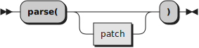

The Highlighter class
==========================

--------------------------

Methods
-------

### new (Class method)

 \

Creates a new Highlighter object. The program to parse
has a *source*, which is an array of strings, and a *name*,
a string that identifies the program. The third argument,
*options*, is optional.

When the *options* argument is specified, it must be a stem
with a default value of 0, and you have to provide values
for the relevant indexes. When the *options* argument is not specified,
a set of default values is provided by the class *init* method.

#### Recognized options indexes and default values

All tail values are case-insensitive.

##### `assignment` {#assignment}

One of `detail`, `full` or `group`.

The value of this compound variable determines
how assignment operator sequences will be highlighted.
The default value for this option is `group`.

When `group` is specified, a single, generic, highlighting class will be
assigned to every assignment sequence. When `detail` is specified,
every assigment sequence will get its own, different, highlighting class
(this means, for example, that all simple assignments, `=`, will
be assigned the same highlighting class, all `+=` assignments will be
assigned a different class, and so on). When `full` is specified,
both a generic and a specific class will be assigned.

The same mechanism is used in a number of other tails below.

#### `classprefix`

Defines the class prefix used in HTML classes.
The default value for this option is `rx-`.

#### `compound`

One of `full`, `yes`,  `1` or `true`, meaning *yes*,
or `variable`, `no`, `0`, or `false`, meaning *no*.

Determines whether, *yes** or *no*, full detailed compound variable
tail highlighing is desired.

The default value for this option is `1`.

#### `constant`

One of `detail`, `full` or `group`. See the description
for [assignment](#assignment) for details.

Defines how the highlighing classes are assigned for elements
which are "taken constants", i.e., strings or symbols taken
as a constant.

The default value for this option is `full`.

##### `mode`

One of `HTML`, `ANSI` or `LaTeX`, this value selects the desired
type of highlighting.

The default value for this option is `HTML`.

#### `numberLines` {#numberlines}

A boolean determining whether lines should be numbered.

The default value for this option is `0`.

#### `operator`

One of `detail`, `full` or `group`. See the description
for [assignment](#assignment) for details.

Defines how the highlighing classes are assigned for elements
and element sequences which are operators. Please note
that is a operator is interrupted by whitespace and/or
comments, highlighing is only applied to the characters
that constitute the operator.

The default value for this option is `group`.

#### `prolog`

A boolean value. Some drivers, like the LaTeX drivers,
may emit an optional prolog containing all the color
definitions and some macros which may be needed
by the highlighted program. The value of this options
controls whether the prolog is printed or not.

The default value for this option is `0`.

#### `special`

One of `detail`, `full` or `group`. See the description
for [assignment](#assignment) for details.

Defines how the highlighting classes are assigned for
elements which are special characters.

The default value for this option is `group`.

#### `startFrom`

The positive integer number assigned to the first
line displayed. This option is ignored When
[numberlines](#numberlines) is `0`.

The default value for this option is `1`.

#### `style`

A string determining the CSS style used for highlighing.
This implementation searches for a file called
<code>rexx-<em>style</em>.css</code> in the `css`
subdirectory. Style names can only use uppercase or lowercase
ANSI letters or numbers (i.e., XRange("ALNUM"), plus ".", "-" or "_".

The current distribution includes two CSS style files:
`rexx-light.css` and `rexx-dark.css`.

The default value for this option is `"dark"`.

### parse

 \

Returns the program, highlighted as per the options specified
at object creation time. The optional *patch* argument
specifies a [StylePatch](../stylepatch/) that may override certain
highlighting classes for the duration of the current
highlighing only. The style patch can also be specified
as a string, or as an array of strings.