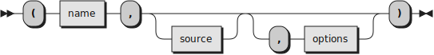

The Rexx.Parser class
=====================

--------------------------------------

`Rexx.Parser` is the main class of [the Rexx Parser](/rexx-parser/) framework.
A **Rexx.Parser** object is a parsed version of a Rexx program.
The parsing process is configurable, according to a set of [options](#options)
which can be specified when the Rexx.Parser object is created.

The supplied or identified program is parsed at object creation time.
The parser version of the program can be accessed using the
[`package`](#package) method of the Rexx.Parser object.
You can also use the [`firstElement`](#firstElement) method to access the
first element in the parsed program [element chain](/rexx-parser/doc/glossary/#element-chain).

### new (Class method) {#new}

 \

Initializes the Rexx.Parser object with a program that has
a certain *name*, a program *source*, and some optional *options*.

*Name* can be any string that identifies the program to parse.
When *source* is not specified, *name* is used to identify
a file containing the source program.

When specified, *source* should be an array of strings containing
the program to be parsed.

The optional argument *options* is an array suitable to
initialize a Rexx Directory object.

Object creation automatically parses the supplied or identified
program. If no error is found during parsing, a Rexx.Package object
is created; you can retrieve this object using the `package` method.

#### Options

The optional *options* argument is an array. Every array has to have
exactly two elements: the first element is the option name,
and the second element is the option value. Here are The
allowed options, and the format of the corresponding values:

doccomments
: A string containing a series of words separated by commas and/or blanks,
  which selects the requested level of doc-comment support.

earlycheck
: An array of values selecting which modalities of [early check](early-check/) will
  be active when parsing the program.

extraLetters
: A string specifying the extra characters to be considered as letters
  (see ANSI 5.3.2).

html:
: Format certain messages, like tracebacks, for display in a browser.

unicode
: When the value is "1", support for TUTOR-flavored Unicode is enabled.


### firstElement

 \

Returns the first element in the parsed program
[element chain](/rexx-parser/doc/glossary/#element-chain).

This is a convenience method. The term `parser~firstElement` is
equivalent to `parser~package~firstElement`.

### package

 \

Returns the Rexx.Package object that represents the parsed version
of the program.

Available options {#options}
-----------------

The `options` argument to the [new](#new) method is
an array that will be used to create a Rexx Directory object,
using

```rexx
  dir = .Directory~sendWith("of", options)
```

This means that every item in `options` has to be a
one-dimensional array containing two elements; the first
item is a unique *key* string, and the second item is
the *value* associated to the key.

Unrecognized keys are ignored. This is the list of
currently recognized keys and their corresponding values.
Keys are transtaled to uppercase when the [Rexx.Parser](.)
object is created.

#### <code>docComments="<em>option1</em> [,] <em>option2</em>..."</code> {#doccomments}

The value associated with the `docComments` key is a collection
of comma- or blank- separated case-insensitive option words.
The following options are recognized:

- `ALL`, the default, means that both standard (block) comments
  and line comments located immediately before a directive
  or a callable label are inspected to see if they are doc-comments.
- `LINE` and `MARKDOWN` mean that line comments located immediately
  before a directive or a callable label are inspected to see
  if they are doc-comments.
- `STANDARD`, `BLOCK` and `CLASSIC` mean that standard comments
  located immediately before a directive or a callable label
  are inspected to see if they are doc-comments.

#### <code>extraLetters=<em>string</em></code> {#extraletters}

The value associated with the `extraLetters` key is a *string*
containing characters that are to be considered letters,
in addition to the ones defined by ooRexx (see the ANSI
standard, section 5.3.2). By default, the set of extra letters
is empty (that is, letters are limited to the `A-Z` and
`a-z` ranges, and to the `"?"`, `"!"` and `"_"` characters).
Markdown and HTML fenced code blocks can specify the value
of this key by using the <code>extraLetters=<em>string</em></code>
attribute on the `rexx` code marker:

```rexx {extraletters="@"}
  -- This is a valid variable name because 'extraletters="@"' was specified
  VariableUsing@AsALetter_____@@@@@ = 1
```
